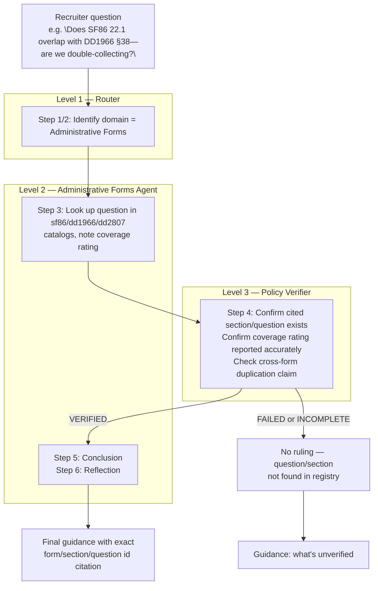

# Administrative Forms — Agent Flow

```mermaid
flowchart TD
    Q["Recruiter question\ne.g. \"Does SF86 22.1 overlap with DD1966 §38—are we double-collecting?\""] --> R

    subgraph L1["Level 1 — Router"]
        R["Step 1/2: Identify domain = Administrative Forms"]
    end

    R --> D

    subgraph L2["Level 2 — Administrative Forms Agent"]
        D["Step 3: Look up question in sf86/dd1966/dd2807\ncatalogs, note coverage rating"]
        C["Step 5: Conclusion\nStep 6: Reflection"]
    end

    D --> V

    subgraph L3["Level 3 — Policy Verifier"]
        V["Step 4: Confirm cited section/question exists\nConfirm coverage rating reported accurately\nCheck cross-form duplication claim"]
    end

    V -->|VERIFIED| C
    V -->|FAILED or INCOMPLETE| E["No ruling — question/section\nnot found in registry"]

    C --> OUT["Final guidance with exact\nform/section/question id citation"]
    E --> OUT2["Guidance: what's unverified"]
```
