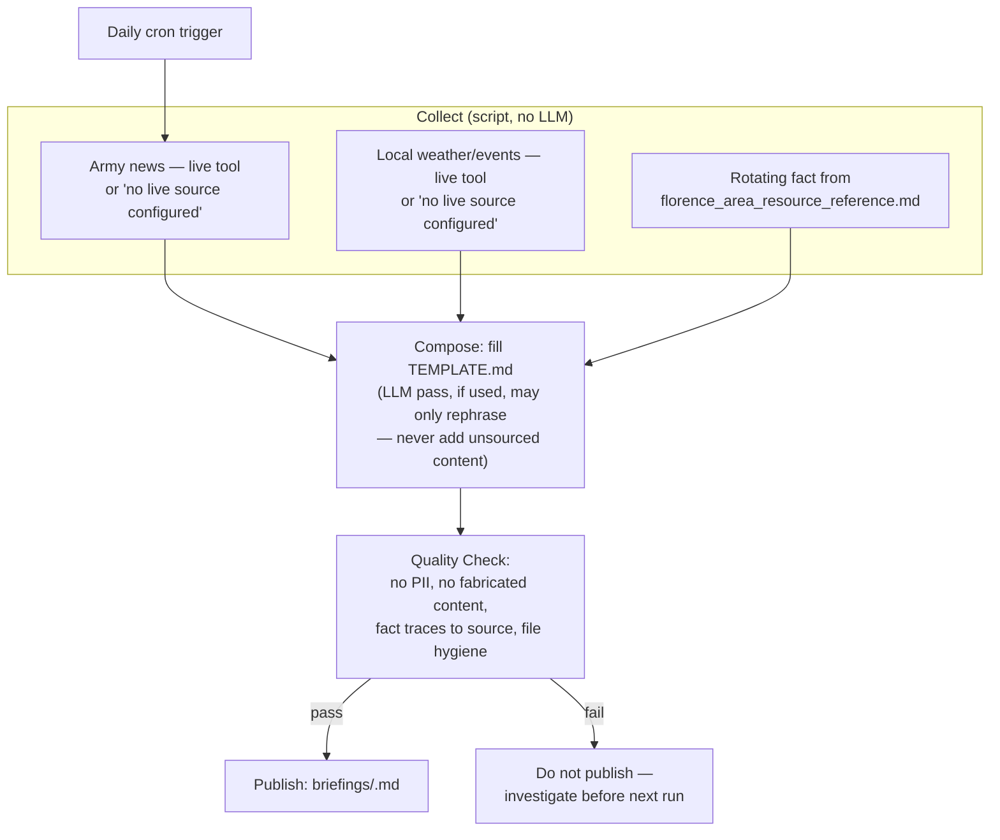

# Daily Area & Army News Brief — Pipeline Flow

Not a Router → Agent → Verifier flow — this is a cron-triggered Collect → Compose → Publish pipeline, modeled on the proven `sc_morning_brief.py` pattern.

