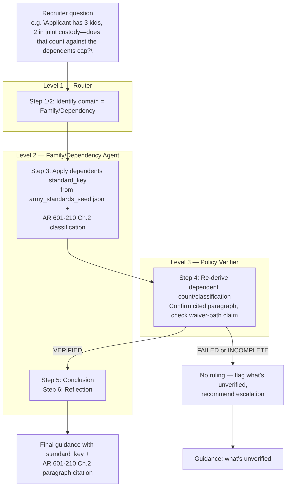

# Family / Dependency — Agent Flow

```mermaid
flowchart TD
    Q["Recruiter question\ne.g. \"Applicant has 3 kids, 2 in joint custody—does that count against the dependents cap?\""] --> R

    subgraph L1["Level 1 — Router"]
        R["Step 1/2: Identify domain = Family/Dependency"]
    end

    R --> D

    subgraph L2["Level 2 — Family/Dependency Agent"]
        D["Step 3: Apply dependents standard_key\nfrom army_standards_seed.json +\nAR 601-210 Ch.2 classification"]
        C["Step 5: Conclusion\nStep 6: Reflection"]
    end

    D --> V

    subgraph L3["Level 3 — Policy Verifier"]
        V["Step 4: Re-derive dependent count/classification\nConfirm cited paragraph, check waiver-path claim"]
    end

    V -->|VERIFIED| C
    V -->|FAILED or INCOMPLETE| E["No ruling — flag what's unverified,\nrecommend escalation"]

    C --> OUT["Final guidance with standard_key +\nAR 601-210 Ch.2 paragraph citation"]
    E --> OUT2["Guidance: what's unverified"]
```
