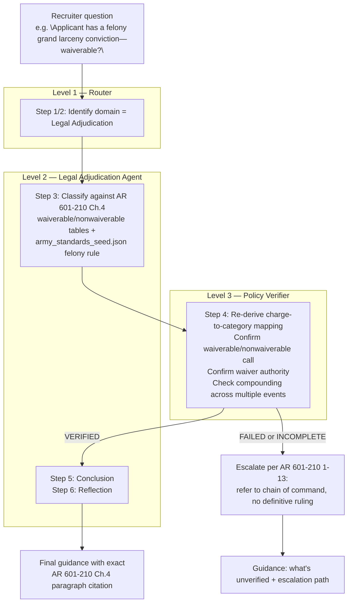

# Legal Adjudication — Agent Flow

```mermaid
flowchart TD
    Q["Recruiter question\ne.g. \"Applicant has a felony grand larceny conviction—waiverable?\""] --> R

    subgraph L1["Level 1 — Router"]
        R["Step 1/2: Identify domain = Legal Adjudication"]
    end

    R --> D

    subgraph L2["Level 2 — Legal Adjudication Agent"]
        D["Step 3: Classify against AR 601-210 Ch.4\nwaiverable/nonwaiverable tables +\narmy_standards_seed.json felony rule"]
        C["Step 5: Conclusion\nStep 6: Reflection"]
    end

    D --> V

    subgraph L3["Level 3 — Policy Verifier"]
        V["Step 4: Re-derive charge-to-category mapping\nConfirm waiverable/nonwaiverable call\nConfirm waiver authority\nCheck compounding across multiple events"]
    end

    V -->|VERIFIED| C
    V -->|FAILED or INCOMPLETE| E["Escalate per AR 601-210 1-13:\nrefer to chain of command, no definitive ruling"]

    C --> OUT["Final guidance with exact\nAR 601-210 Ch.4 paragraph citation"]
    E --> OUT2["Guidance: what's unverified + escalation path"]
```
