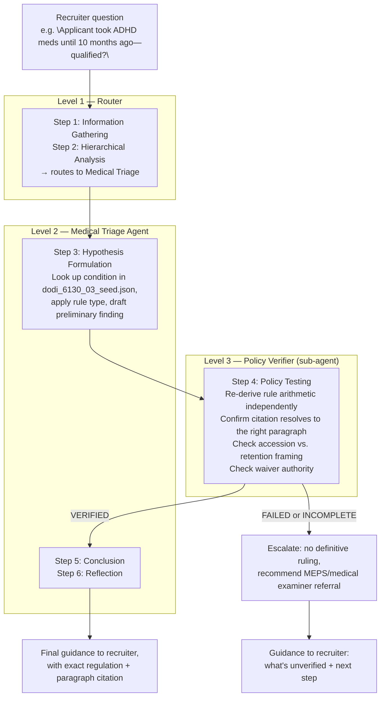

# Medical Triage — Agent Flow

How a recruiter's medical-eligibility question moves through the three agent tiers, mapped to the Algorithm of Thoughts framework.

## Why verification sits between hypothesis and conclusion

The Level-2 agent's Step 3 hypothesis is a draft, not a ruling. It only becomes a Step 5 Conclusion if the Level-3 sub-agent independently re-derives the same result from the doctrine and standards registry. A **FAILED** or **INCOMPLETE** verdict routes to escalation instead of a ruling — the system is built to say "I don't have a grounded answer" rather than let an unverified hypothesis reach a recruiter as definitive guidance.
