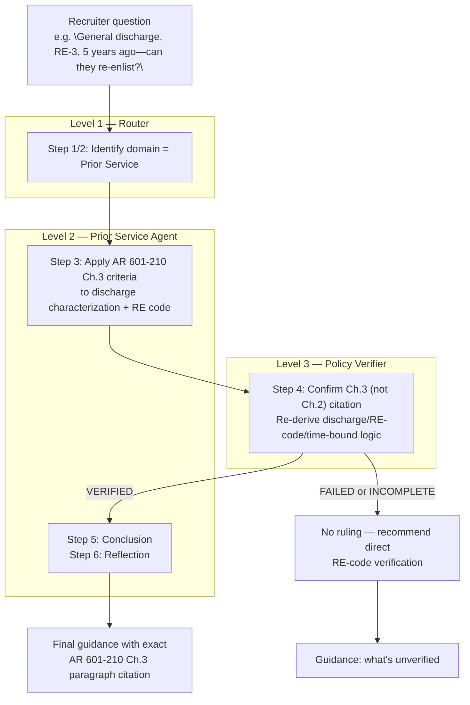

# Prior Service / Re-entry — Agent Flow

```mermaid
flowchart TD
    Q["Recruiter question\ne.g. \"General discharge, RE-3, 5 years ago—can they re-enlist?\""] --> R

    subgraph L1["Level 1 — Router"]
        R["Step 1/2: Identify domain = Prior Service"]
    end

    R --> D

    subgraph L2["Level 2 — Prior Service Agent"]
        D["Step 3: Apply AR 601-210 Ch.3 criteria\nto discharge characterization + RE code"]
        C["Step 5: Conclusion\nStep 6: Reflection"]
    end

    D --> V

    subgraph L3["Level 3 — Policy Verifier"]
        V["Step 4: Confirm Ch.3 (not Ch.2) citation\nRe-derive discharge/RE-code/time-bound logic"]
    end

    V -->|VERIFIED| C
    V -->|FAILED or INCOMPLETE| E["No ruling — recommend direct\nRE-code verification"]

    C --> OUT["Final guidance with exact\nAR 601-210 Ch.3 paragraph citation"]
    E --> OUT2["Guidance: what's unverified"]
```
