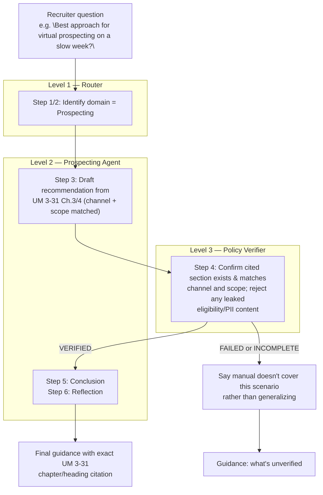

# Prospecting — Agent Flow

Note: this domain carries no eligibility/waiver logic and no applicant PII — verification here checks technique accuracy against the manual, not a compliance cross-walk.
