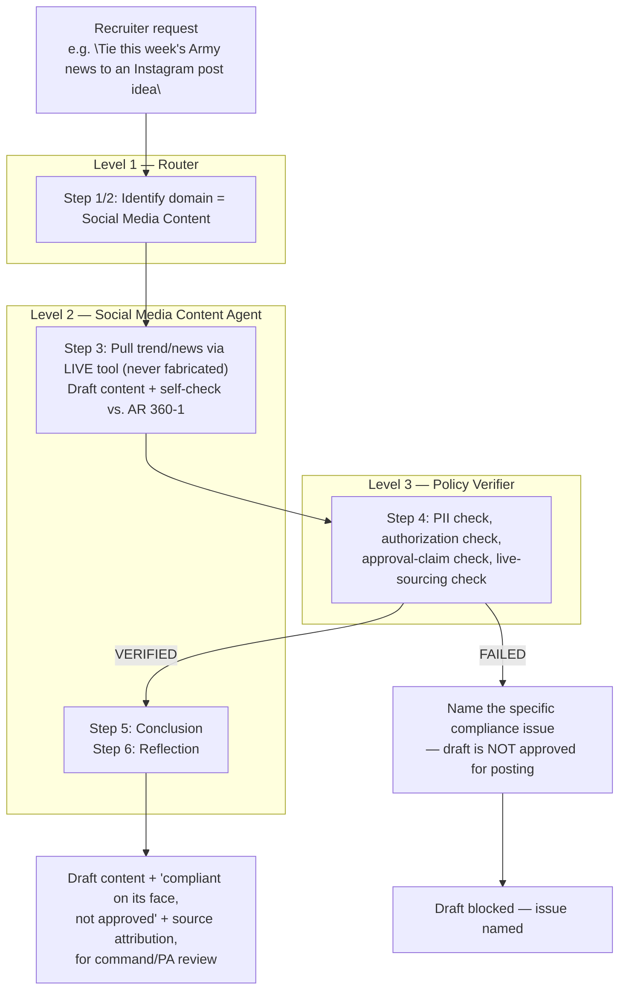

# Social Media Content — Agent Flow

```mermaid
flowchart TD
    Q["Recruiter request\ne.g. \"Tie this week's Army news to an Instagram post idea\""] --> R

    subgraph L1["Level 1 — Router"]
        R["Step 1/2: Identify domain = Social Media Content"]
    end

    R --> D

    subgraph L2["Level 2 — Social Media Content Agent"]
        D["Step 3: Pull trend/news via LIVE tool (never fabricated)\nDraft content + self-check vs. AR 360-1"]
        C["Step 5: Conclusion\nStep 6: Reflection"]
    end

    D --> V

    subgraph L3["Level 3 — Policy Verifier"]
        V["Step 4: PII check, authorization check,\napproval-claim check, live-sourcing check"]
    end

    V -->|VERIFIED| C
    V -->|FAILED| E["Name the specific compliance issue\n— draft is NOT approved for posting"]

    C --> OUT["Draft content + 'compliant on its face,\nnot approved' + source attribution,\nfor command/PA review"]
    E --> OUT2["Draft blocked — issue named"]
```

Note: this agent never claims final approval — AR 360-1 Ch.2 assigns that to the command web content manager, outside this agent's scope.
