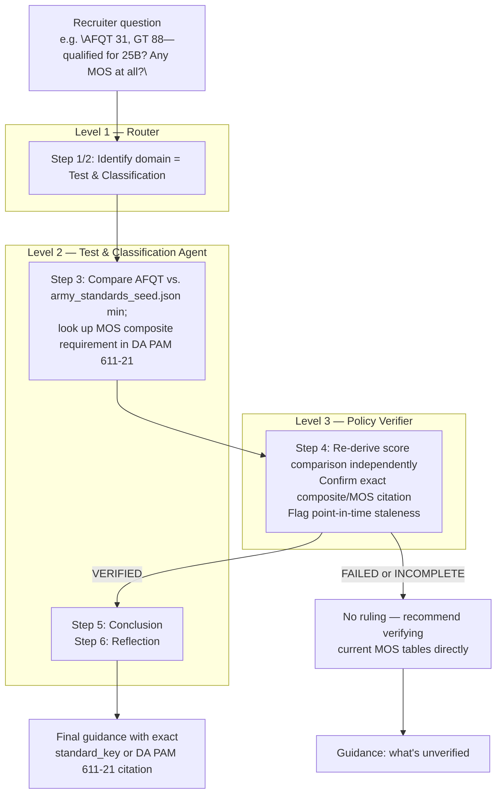

# Test & Classification — Agent Flow

```mermaid
flowchart TD
    Q["Recruiter question\ne.g. \"AFQT 31, GT 88—qualified for 25B? Any MOS at all?\""] --> R

    subgraph L1["Level 1 — Router"]
        R["Step 1/2: Identify domain = Test & Classification"]
    end

    R --> D

    subgraph L2["Level 2 — Test & Classification Agent"]
        D["Step 3: Compare AFQT vs. army_standards_seed.json min;\nlook up MOS composite requirement in DA PAM 611-21"]
        C["Step 5: Conclusion\nStep 6: Reflection"]
    end

    D --> V

    subgraph L3["Level 3 — Policy Verifier"]
        V["Step 4: Re-derive score comparison independently\nConfirm exact composite/MOS citation\nFlag point-in-time staleness"]
    end

    V -->|VERIFIED| C
    V -->|FAILED or INCOMPLETE| E["No ruling — recommend verifying\ncurrent MOS tables directly"]

    C --> OUT["Final guidance with exact\nstandard_key or DA PAM 611-21 citation"]
    E --> OUT2["Guidance: what's unverified"]
```
