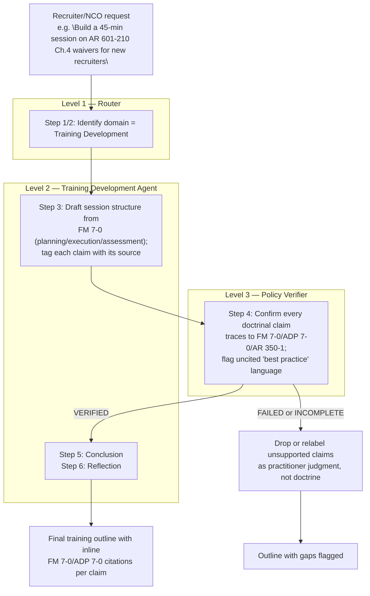

# Training Development — Agent Flow

```mermaid
flowchart TD
    Q["Recruiter/NCO request\ne.g. \"Build a 45-min session on AR 601-210 Ch.4 waivers for new recruiters\""] --> R

    subgraph L1["Level 1 — Router"]
        R["Step 1/2: Identify domain = Training Development"]
    end

    R --> D

    subgraph L2["Level 2 — Training Development Agent"]
        D["Step 3: Draft session structure from\nFM 7-0 (planning/execution/assessment);\ntag each claim with its source"]
        C["Step 5: Conclusion\nStep 6: Reflection"]
    end

    D --> V

    subgraph L3["Level 3 — Policy Verifier"]
        V["Step 4: Confirm every doctrinal claim\ntraces to FM 7-0/ADP 7-0/AR 350-1;\nflag uncited 'best practice' language"]
    end

    V -->|VERIFIED| C
    V -->|FAILED or INCOMPLETE| E["Drop or relabel unsupported claims\nas practitioner judgment, not doctrine"]

    C --> OUT["Final training outline with inline\nFM 7-0/ADP 7-0 citations per claim"]
    E --> OUT2["Outline with gaps flagged"]
```
